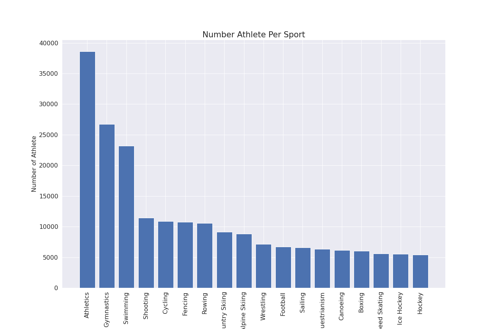
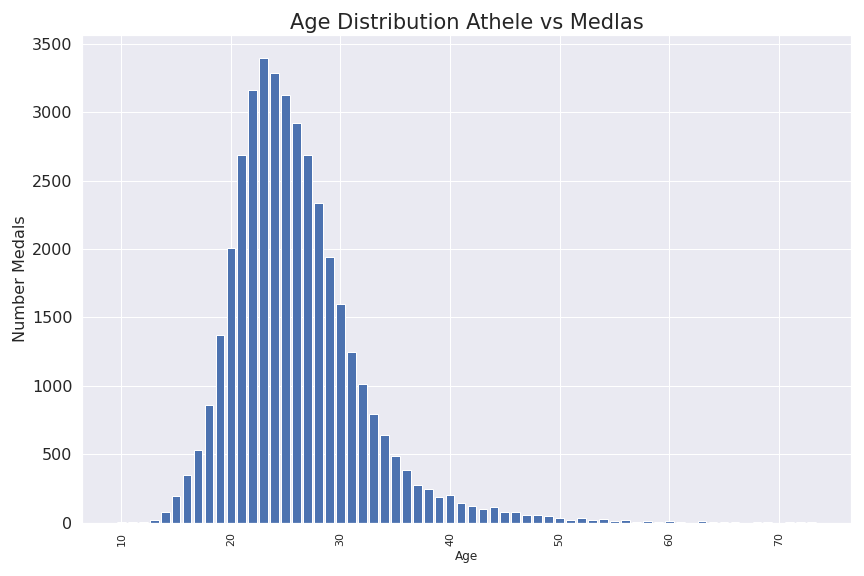
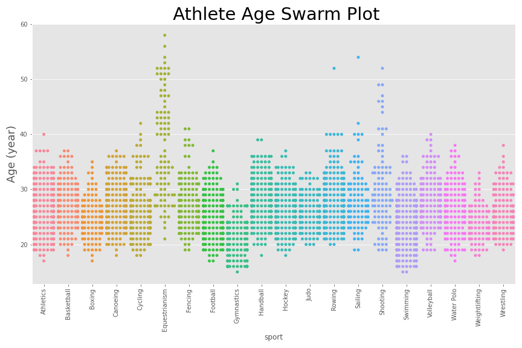
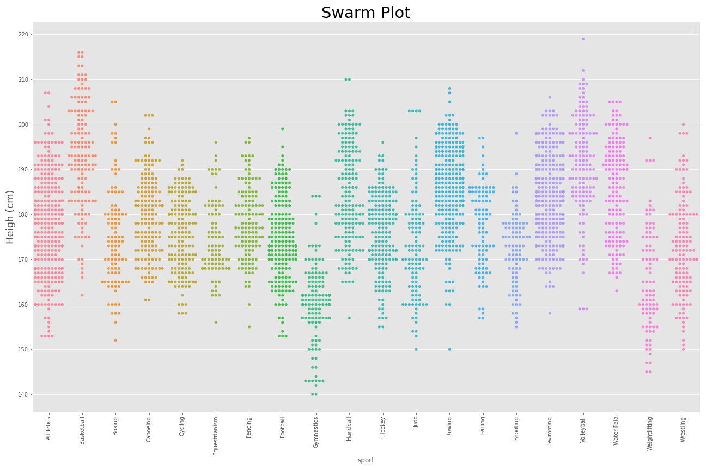
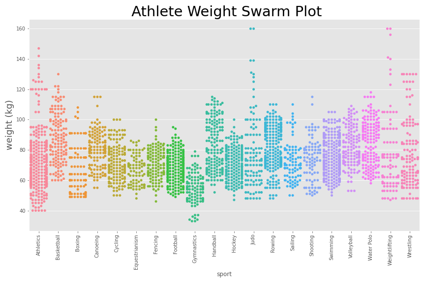

# sql-olympics

Getting hyped for the olympics by practicing SQL queries on historical olympic data

Read my [medium article]( https://hirazone.medium.com/data-visualization-olympics-dataset-with-possql-1a6f80f0d910)!

All code is available in the notebook entitled `olympic-exploration.ipynb`. Note that if you want to follow along, you will need to set up a local PostgreSQL server by installing [PostgreSQL](https://www.postgresqltutorial.com/install-postgresql/) and [PgAdmin](https://www.pgadmin.org/) onto your local machine.

